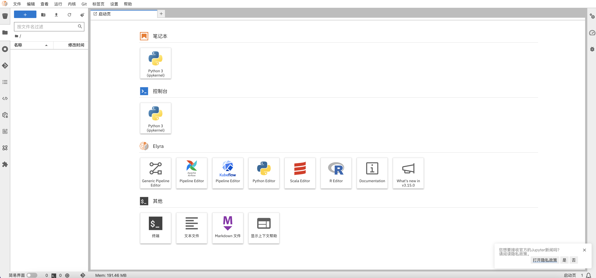

# Kubeflow Chart

[English Version Here](./README-en.md)

使用 [Helm](https://helm.sh/) Chart 在多种环境更加快速安装和配置 [Kubeflow](https://www.kubeflow.org/)。

作为 [kubeflow manifests](https://github.com/kubeflow/manifests) 的另一种开源部署方式，您可以轻松快速的在任意环境（公有云，本地集群，minikube）之上部署并运行 Kubeflow。

## 开源版和企业版

参考 https://www.alauda.cn/open/detail/id/701.html 了解更多企业版信息和联系试用

相对于开源版本，企业版提供了更多，更完善的功能增强，包括：
- 功能增强
  - 增强的集群分布式训练调度器
  - 增强的模型仓库
  - 集成/增强的 MLFlow 实验追踪
  - 使用 SQL 语言的建模工具：SQLFlow
  - 可视化拖拽开发环境
  - 使用工作流编排分布式训练任务
  - 完整汉化
  - 内置教程＋案例notebook
  - 多环境适配、快速部署
  - 国产化硬件支持
- 高性能
  - Intel Tensorflow 
  - NeuralCompressor
  - vGPU支持
- 高可用
  - MLOps Control Plane 高可用
  - 推理服务高可用


## 快速安装(本地 Minikube)：

1. `helm repo add alauda https://alauda.github.io/kubeflow-chart`
1. `helm install kubeflow alauda/kubeflow`

### 使用国内镜像源安装

使用 `values-cn.yaml` 覆盖安装镜像配置：

```bash
wget -O values-cn.yaml https://raw.githubusercontent.com/alauda/kubeflow-chart/main/values-cn.yaml
helm install kubeflow alauda/kubeflow -f values-cn.yaml
```

### 访问 Kubeflow 界面：

启动端口转发：

```bash
kubectl port-forward svc/istio-ingressgateway -n istio-system --address=0.0.0.0 8080:80
```

然后通过浏览器访问：`http://localhost:8080/`, 使用默认账号密码：`user@example.com`, `12341234` 即可登录。

### 使用 MLOps IDE

在目录 `mlops-ide` 下包含了构建社区版本的 MLOps IDE 的 Dockerfile。如您希望构建自己的 IDE 镜像，可以执行: `docker build -f mlops-ide/Dockerfile .` 构建镜像，也可以修改 `Dockerfile` 构建定制的镜像，比如支持 GPU + CUDA 的镜像，可以替换 `FROM nvidia/cuda:11.4.3-devel-ubuntu20.04` 即可。

同时我们预先构建了镜像：`typhoon1986/mlops-ide:3.15.0`，可以直接在创建 Notebook 时，勾选“自定义镜像”，并输入此镜像地址即可快速试用。进入 Jupyterlab 首页之后，可以看到对应功能已经启用，也可以在 settings 目录下选择界面语言：



注：社区版本 MLOps IDE 暂未支持流水线内编排分布式训练，可以关注此 PR 的进度：https://github.com/elyra-ai/elyra/pull/3102

关于 Kubeflow 的使用，我们准备了一些帮助您快速上手的 Notebook 教程，可以将这些文件拖拽到 Notebook 环境中即可运行示例：

- [01快速开始.ipynb](examples/01%E5%BF%AB%E9%80%9F%E5%BC%80%E5%A7%8B.ipynb)
- [05分布式训练TFJob和任务调度](examples/05%E5%88%86%E5%B8%83%E5%BC%8F%E8%AE%AD%E7%BB%83TFJob%E5%92%8C%E4%BB%BB%E5%8A%A1%E8%B0%83%E5%BA%A6.ipynb)
- [06可视化分布式训练](examples/06%E5%8F%AF%E8%A7%86%E5%8C%96%E5%88%86%E5%B8%83%E5%BC%8F%E8%AE%AD%E7%BB%83.ipynb)

### 配置包含认证的私有镜像源：

如果您将镜像同步到一个私有镜像源，并包含认证，可以在 `values.yaml` 中增加如下认证信息配置：

```yaml
global:
  imageCredentials: ""
  useRegistryCredentials: false
  registry: quay.io
  username: someone
  password: sillyness
  email: someone@host.com
minio:
  useKubeflowImagePullSecrets: true
```

## 卸载 Kubeflow

执行命令 `helm delete kubeflow` 即可完成卸载。

## 在生产集群中部署 Kubeflow

在生产集群中部署 Kubeflow，通常需要根据当前集群环境信息，完成如下配置：

### 使用 HTTPS

Kubeflow 强依赖 HTTPS，只有使用 `localhost` 访问可以不使用 HTTPS，所以在使用 Minikube 快速部署时不需要配置 HTTPS 相关配置项。当需要配置 HTTPS 时，请配置 `values.yaml` 中的 `tlsCrt` 和 `tlsKey` 为 HTTPS 证书。

### 配置访问方式

- 通过 port-forward 方式（不推荐）：
  - 使用 HTTP: `kubectl port-forward svc/istio-ingressgateway -n istio-system --address=0.0.0.0 8080:80`， 然后访问执行该命令的服务器地址：`http://ip/`。
  - 开启 HTTPS: `kubectl port-forward svc/istio-ingressgateway -n istio-system --address=0.0.0.0 443:443`， 然后访问执行该命令的服务器地址：`https://ip/`。
- 使用默认账号密码：`user@example.com`, `12341234` 即可登录。
- 通过 node port 方式：查看 istio ingressgateway 服务是否开启了 nodeport：`kubectl -n istio-system get svc istio-ingressgateway`，根据[这里](https://kubernetes.io/zh/docs/concepts/services-networking/service/#type-nodeport) 配置 nodeport 之后，即可访问。
- 使用 Ingress: 集群中 Ingress 可用时，可以配置 `values.yaml` 中 `enableIngress: true`， 并设置 `kubeflowHost`
  为需要使用的访问域名，比如 `kubeflowHost: "kubeflow.test.info"`

### 配置 Dex 登录认证 (可选)

如果不使用本 chart 内置的 dex 部署，即需要连接到已有的 dex 部署，需要：

1. 修改 `dex: enabled: false`
2. 修改 `values.yaml` 下面的选项已联通您已有的 dex：
```
# 配置和认证服务 Dex 的联动
oidcAuthURL: /dex/auth
oidcProvider: http://dex.auth.svc.cluster.local:5556/dex
oidcRedirectURL: /login/oidc
skipAuthURI: "/dex"
useridClaim: email
useridHeader: kubeflow-userid
useridPrefix: "\"\""
oidcScopes: "profile email groups"
```

